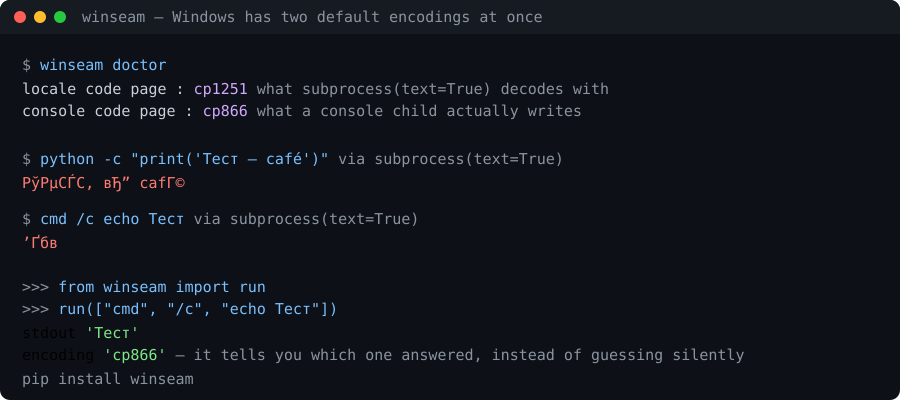

# winseam

[](https://pypi.org/project/winseam/)
[](https://pypi.org/project/winseam/)
[](https://github.com/AlKor13/winseam/actions/workflows/ci.yml)
[](LICENSE)



Your Python tool works. Then someone runs it on Windows, and the output is `Тест — café`, or `shutil.rmtree` refuses to delete a Git clone, or `json.load(open(path))` raises `UnicodeDecodeError` on a file that is plainly valid UTF-8.

None of that is bad luck. Windows has **more than one default encoding at a time**, and the standard library decodes every child process with the wrong one.

```
$ winseam doctor
  locale code page    : cp1251   (what subprocess text=True decodes with)
  console code page   : cp866    (what a console child writes)
```

Two code pages, one process tree. So there is no single `encoding=` that is correct for all of your children:

| child | `subprocess.run(text=True)` | `winseam.run` | what it actually wrote |
|---|---|---|---|
| `python -c "print('Тест — café')"` | `Тест — cafГ©` | `Тест — café` | utf-8 |
| `cmd /c echo Тест` | `’Ґбв` | `Тест` | cp866 |
| `git --version` | ok | ok | utf-8 |

```python
from winseam import run

result = run(["git", "log", "-1", "--format=%s"])
print(result.stdout)     # correct text, whoever the child was
print(result.encoding)   # 'utf-8' -- and it tells you, instead of guessing silently
```

## Install

```bash
pip install winseam
```

No dependencies. Off Windows every function is a thin pass-through with identical behaviour, so the call site is written once.

## Why this does not go away in Python 3.15

[PEP 686](https://peps.python.org/pep-0686/) makes UTF-8 the default in Python 3.15, which fixes `open()` and `text=True` **for Python's own data**. It does not touch `cmd`, `git`, `npm`, `ffmpeg` or `az`: they keep writing the console code page. After 3.15 their output stops being silent mojibake and starts being `UnicodeDecodeError` instead.

The seam moves. It does not close. `winseam.run` decides per child — it *configures* a Python child through `PYTHONUTF8`/`PYTHONIOENCODING` rather than guessing at it, and reads a console child in the code page a console child writes.

## What it gives you

**The process boundary**

```python
run(args, encoding=None, input=None, check=False, **subprocess_kwargs)
```

A `CompletedProcess` with `str` output, plus `.encoding` and `.encodings` (per stream). `text=True` is refused with a message rather than accepted and ignored. A `str` passed as `input` is encoded for that particular child, and never gets a BOM — PowerShell 5.1 adds one to the pipe it hands a child, and that byte has broken every header parser it has ever met.

**The filesystem**

```python
read_text(path)      # utf-8, and a BOM written by another tool is not your problem
write_text(path, s)  # utf-8, no BOM, '\n' stays '\n'
read_json(path)      # the one that crashes in every bug report
write_json(path, d)  # non-ASCII stays readable, not Тест

rmtree(path)         # deletes read-only files -- i.e. can delete a .git directory
replace(src, dst)    # survives a scanner holding the destination for a moment
unlink(path)         # clears the read-only bit, waits out a transient handle
```

Measured on a stock Windows 11 box, where six of ten standard-library operations fail:

```
rmtree on a read-only file     PermissionError [WinError 5]    <- how Git stores every object
delete a file someone opened   PermissionError [WinError 32]
replace a file someone opened  PermissionError [WinError 5]
open()/Path.read_text()        UnicodeDecodeError (cp1251)
subprocess text=True           mojibake
NamedTemporaryFile reopen      PermissionError
```

## Find them before your users do

```
$ winseam audit .

src/runner.py
    41  WS001  subprocess.run(text=True) without encoding= decodes the child with the ANSI
               code page; a UTF-8 child is mojibake and a console child is worse
        fix: winseam.run(...), or pass encoding= explicitly
    88  WS004  shutil.rmtree() without onexc= fails with PermissionError on read-only files,
               including every object in a .git directory
        fix: winseam.rmtree(path)

51 findings in 26 files
  WS001  5
  WS002  30
  WS003  16
```

It is a static pass, so it runs on Linux CI and on projects you do not own. `--json` for machine-readable output, `--exit-zero` for a non-blocking CI step. `winseam doctor` prints the code pages of the machine you are on, which is the first question on every Windows bug report and the one nobody can answer from memory.

| code | what it finds |
|---|---|
| WS001 | `subprocess(text=True)` with no `encoding=` |
| WS002 | `open()` in text mode with no `encoding=` |
| WS003 | `Path.read_text()` / `write_text()` with no `encoding=` |
| WS004 | `shutil.rmtree()` with no `onexc=` |

### In pre-commit

```yaml
repos:
  - repo: https://github.com/AlKor13/winseam
    rev: v0.1.0
    hooks:
      - id: winseam-audit          # or winseam-audit-warn, which never fails the commit
```

### In GitHub Actions

```yaml
      - uses: AlKor13/winseam@v0.1.0
        with:
          path: src
          fail-on-findings: "false"   # report into the job summary while you adopt it
```

The audit is static, so both run on Linux runners and find what only breaks for your Windows users.

## What this does not claim

- **Single-byte code pages cannot be detected.** cp866 bytes decode "successfully" as cp1251 and give mojibake. UTF-8 is self-validating, so it is tried first and is nearly always right; below it the ladder is an informed prior, which is exactly why `.encoding` is returned rather than kept private. Pass `encoding=` when you know better.
- **Retries do not beat a handle that is genuinely held.** They wait out an indexer or a scanner, which is the usual cause; a file another process is really using still fails, and should, rather than hanging.
- **It is not a compatibility shim for everything.** Four constructs, measured, that account for nearly every Windows text bug in Python tooling.

## License

MIT
